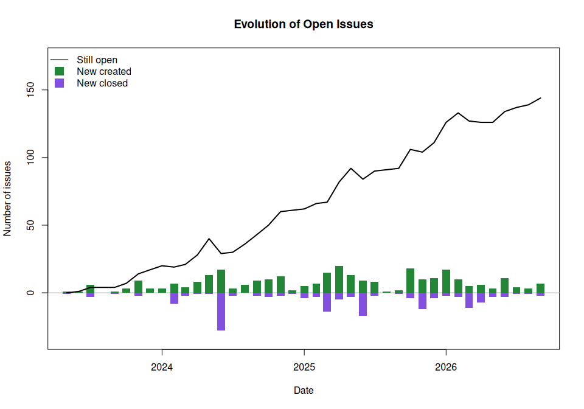
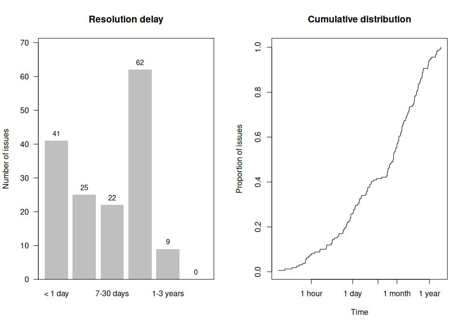
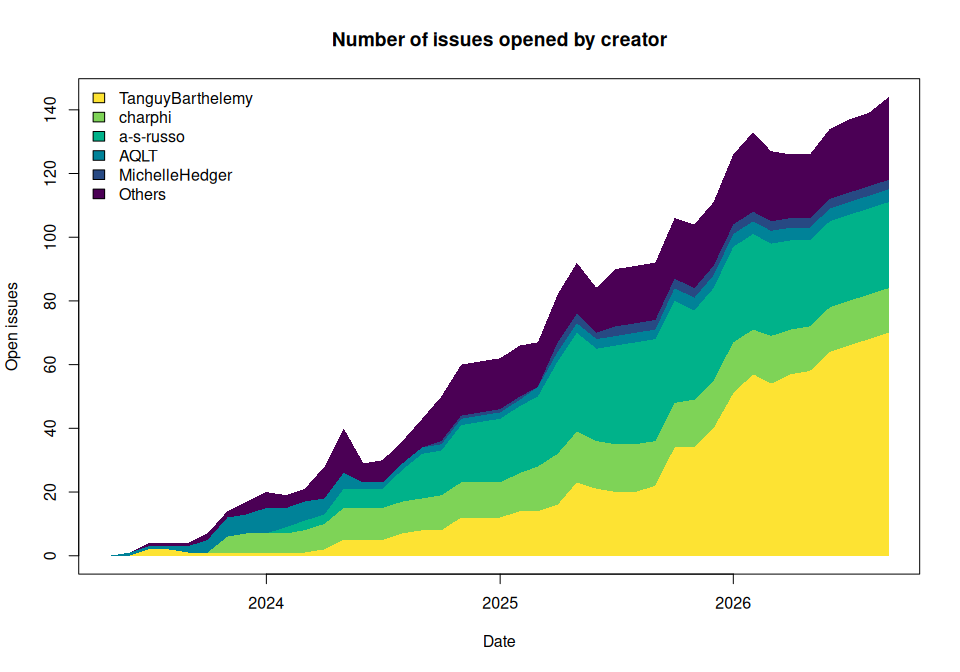

<!-- README.md is generated from README.Rmd. Please edit that file -->

# {IssueTrackeR} <a href="https://tanguybarthelemy.github.io/IssueTrackeR/"></a>

<!-- badges: start -->

[](https://CRAN.R-project.org/package=IssueTrackeR)
[](https://github.com/TanguyBarthelemy/IssueTrackeR/actions/workflows/R-CMD-check.yaml)
[](https://github.com/TanguyBarthelemy/IssueTrackeR/actions/workflows/pkgdown.yaml)

[](https://github.com/TanguyBarthelemy/IssueTrackeR/actions/workflows/lint.yaml)
[](https://app.codecov.io/gh/TanguyBarthelemy/IssueTrackeR)
[](https://github.com/TanguyBarthelemy/IssueTrackeR/actions/workflows/test-mutation.yaml)
[](https://www.codefactor.io/repository/github/tanguybarthelemy/issuetracker)
<!-- badges: end -->

**{IssueTrackeR}** is an R package designed to retrieve and manage
GitHub issues directly within R. This package allows users to
efficiently track and handle issues from their GitHub repositories.

This package relies a lot on the package
[{gh}](https://github.com/r-lib/gh) to use the GitHub API and retrieve
data from GitHub.

## Installation

You can install {IssueTrackeR} from
[CRAN](https://CRAN.R-project.org/package=IssueTrackeR):

``` r
install.packages("IssueTrackeR")
```

### Development

You can install the development version of {IssueTrackeR} from
[GitHub](https://github.com/):

``` r
# install.packages("pak")
pak::pak("TanguyBarthelemy/IssueTrackeR")
```

## Features

- **Multi-source support**: Fetch issues from GitHub, GitLab, or local
  YAML files.
- **Visualization**: Plot issue trends, resolution times, and backlog
  evolution.
- **Save issues locally**: Write the issues, labels and milestones
  locally to access it without connection.

## Usage

``` r
library("IssueTrackeR")
#> Currently, the default options are:
#> - location for datasets is /tmp/Rtmp45fCJp/data
#> - owner: rjdverse
#> - repo: rjdemetra
#> 
#> Attaching package: 'IssueTrackeR'
#> The following objects are masked from 'package:base':
#> 
#>     append, sample, write
```

### Create a selector

``` r
# Configure {gitlabr} to retrieve issues from GitLab
gitlabr::set_gitlab_connection(
    gitlab_url = "https://gitlab.com",
    private_token = Sys.getenv("GITLAB_TRACTORTOM_API")
)

# Select repos from GitHub
selector1 <- init_selector(
    source = "GitHub",
    owner = "TanguyBarthelemy",
    repo = "IssueTrackeR"
)

# Select project from GitLab
selector2 <- init_selector(
    source = "GitLab",
    project_id = c(51699988, 29346974, 15028532)
)

# Select list of issues from local files
selector3 <- init_selector(
    source = "local",
    file = file.path(
        system.file("data_issues", package = "IssueTrackeR"),
        "list_issues.yaml"
    )
)

selector_issues <- merge_selector(selector1, selector2, selector3)
selector_other <- merge_selector(selector1, selector2)
```

### Get the issues

To get information from a repository, you can call the functions
`get_issues`, `get_labels` and `get_milestones`:

``` r
my_issues <- get_issues(selector = selector_issues)
#> Repo: IssueTrackeR  owner: TanguyBarthelemy 
#> Project id: 51699988 
#> Project id: 29346974 
#> Project id: 15028532
#> The issues will be read from /usr/local/lib/R/site-library/IssueTrackeR/data_issues/list_issues.yaml.
my_labels <- get_labels(selector = selector_other)
#> Repo: IssueTrackeR  owner: TanguyBarthelemy 
#> Reading labels... Done!
#> 41 labels found.
#> Project id: 51699988 
#> Project id: 29346974 
#> Project id: 15028532
my_milestones <- get_milestones(selector = selector_other)
#> Repo: IssueTrackeR  owner: TanguyBarthelemy 
#> Reading milestones... 
#>  -  v2.1.0 ... Done!
#>  -  v2.0.0 ... Done!
#> Done! 2 milestones found.
#> Project id: 51699988 
#> Done! 2 milestones found.
#> Project id: 29346974 
#> Done! 0 milestones found.
#> Project id: 15028532 
#> Done! 0 milestones found.
```

### Save issues in local

You can also write the datasets in local with `write()`:

``` r
write(
    x = my_issues,
    dataset_dir = tempdir()
)
#> The datasets will be exported to /tmp/Rtmp45fCJp/list_issues.yaml.

write(
    x = my_labels,
    dataset_dir = tempdir()
)
#> The datasets will be exported to /tmp/Rtmp45fCJp/list_labels.yaml.

write(
    x = my_milestones,
    dataset_dir = tempdir()
)
#> The datasets will be exported to /tmp/Rtmp45fCJp/list_milestones.yaml.
```

### Filtering

You can filter the output based on its content using the `with_text()`
function:

``` r
filtered_issues <- my_issues |> 
    with_labels("bug") |> 
    with_text("format") |>
    with_comments()
```

### Visualisation

``` r
# Plot creation/closure rates
plot(my_issues, type = "created-closed")
```



``` r

# Plot resolution time distribution
plot(my_issues, type = "resolution-time")
```



``` r

# Plot by category (e.g., by creator, milestone, or repo)
plot(my_issues, type = "area-chart", by = "creator", n = 5)
```



## Contributing

Contributions are welcome! Please feel free to submit a pull request or
report any issues.

## License

This project is licensed under the MIT License. See the
[LICENSE](LICENSE) file for details.
